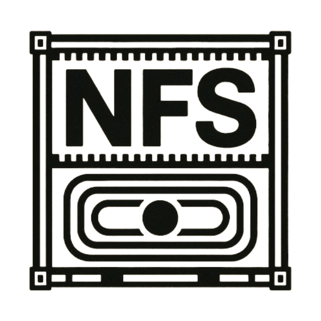

# andrewkidd/nfs-server



NFS running in an alpine container, built for ARM and X86

This is a fork of [ehough/docker-nfs-server](https://github.com/ehough/docker-nfs-server) with some minor updates. Original credit goes there.


## Building

### Locally
Build directly from the `src` context:

```sh
docker build -f src/Dockerfile ./src -t andrewkidd/nfs-server:local
```


### GitHub WorkFlow

GitHub will build and publish linux/amd64 and linux/arm64 images automatically when the pre-requisites are met.

This process is defined in
`.github/workflows/docker-multiarch.yml`.

#### Pre-requisites
 - Triggers: Changes made to `src` files
 - Tag: Commit must be tagged with `v*`
 - Secrets: The following must be defined in your GitHub project 
   - DOCKERHUB_REPO
   - DOCKERHUB_USERNAME
   - DOCKERHUB_TOKEN 

## Running

### Docker
Example host-network run with a bind-mounted NFS root:

```sh
docker run --rm --name nfs-server \
  --privileged \
  --network host \
  -e NFS_EXPORT_0="/srv/nfsshare *(rw,fsid=0,async,no_subtree_check,no_auth_nlm,insecure,no_root_squash)" \
  -e NFS_VERSION=3 \
  -v /host/path/to/share:/srv/nfsshare \
  andrewkidd/nfs-server:latest
```

### Docker Compose
```
services:
  pi-nfs:
    image: andrewkidd/nfs-server
    container_name: pi-nfs
    privileged: true
    profiles:
      - netboot
      - debian-netboot
    env_file:
      - .env
    environment:
      NFS_VERSION: "3"
      NFS_EXPORT_0: "/mnt/nfsshare *(rw,fsid=0,async,no_subtree_check,no_auth_nlm,insecure,no_root_squash)"
      NFS_LOG_LEVEL: "DEBUG"
    volumes:
      - ./README.md:/mnt/nfsshare/test.txt:ro
      - netboot-os-data:/mnt/nfsshare
    ports:
      - 111:111
      - 111:111/udp
      - 2049:2049
      - 2049:2049/udp
      - 32765-32768:32765-32768
      - 32765-32768:32765-32768/udp
    healthcheck:
      test: ["CMD", "test", "-f", "/mnt/nfsshare/test.txt"]
      interval: 1m
      timeout: 5s
      retries: 0
      start_period: 1m
    restart: unless-stopped

volumes:
  netboot-os-data:
```

### Kubernetes

```
apiVersion: apps/v1
kind: DaemonSet
metadata:
  name: nfs
spec:
  selector:
    matchLabels:
      app: netboot
      component: nfs
  updateStrategy:
    type: RollingUpdate
  template:
    metadata:
      labels:
        app: netboot
        component: nfs
    spec:
      hostNetwork: true
      dnsPolicy: ClusterFirstWithHostNet
      hostPID: true
      initContainers:
        - name: disable-host-rpcbind
          image: alpine:3.20
          securityContext:
            privileged: true
          command: ["/bin/sh","-c"]
          args:
            - |
              # Stop/disable host rpcbind so the pod's rpcbind can own port 111.
              nsenter --mount=/proc/1/ns/mnt --pid=/proc/1/ns/pid -- sh -c '
                systemctl stop rpcbind.socket rpcbind.service || true
                systemctl disable rpcbind.socket rpcbind.service || true
                systemctl mask rpcbind.socket rpcbind.service || true
              '
        - name: load-nfsd
          image: alpine:3.20
          securityContext:
            privileged: true
          command: ["/bin/sh","-c"]
          args:
            - |
              set -e
              apk add --no-cache kmod util-linux >/dev/null 2>&1 || true
              modprobe nfsd || true
              modprobe nfs || true
              modprobe lockd || true
              mkdir -p /var/lib/nfs/rpc_pipefs /var/lib/nfs/sm /var/lib/nfs/sm.bak /var/lib/nfs/v4recovery
              : > /var/lib/nfs/state
              chown 0:0 /var/lib/nfs/state && chmod 600 /var/lib/nfs/state || true
              nsenter --mount=/proc/1/ns/mnt -- sh -c '
                if ! mountpoint -q /proc/fs/nfsd 2>/dev/null; then
                  mount -t nfsd nfsd /proc/fs/nfsd || true
                fi
                # disable v2, enable v3, disable v4 family to silence "2: Unsupported version"
                if [ -w /proc/fs/nfsd/versions ]; then
                  printf -- "-2 +3 -4 -4.1 -4.2\n" > /proc/fs/nfsd/versions 2>/dev/null || true
                fi
              '
          volumeMounts:
            - name: modules
              mountPath: /lib/modules
              readOnly: true
            - name: nfs-state
              mountPath: /var/lib/nfs
      containers:
        - name: nfs
          image: andrewkidd/nfs-server:v2.2.6
          imagePullPolicy: IfNotPresent
          securityContext:
            privileged: true
            capabilities:
              add:
                - SYS_ADMIN
          lifecycle:
            postStart:
              exec:
                command: ["/bin/sh","-c","mkdir -p /var/lib/nfs/rpc_pipefs"]
          env:
            - name: NFS_VERSION
              value: "3"
            - name: NFS_EXPORT_0
              value: "/mnt/nfsshare *(rw,fsid=0,async,no_subtree_check,no_auth_nlm,insecure,no_root_squash)"
            - name: NFS_LOG_LEVEL
              value: "DEBUG"
            - name: MOUNTD_PORT
              value: "32767"
            - name: STATD_PORT
              value: "32765"
            - name: LOCKD_TCPPORT
              value: "4045"
            - name: LOCKD_UDPPORT
              value: "4045"
          ports:
            - name: rpcbind-tcp
              containerPort: 111
              protocol: TCP
            - name: rpcbind-udp
              containerPort: 111
              protocol: UDP
            - name: nfs-tcp
              containerPort: 2049
              protocol: TCP
            - name: nfs-udp
              containerPort: 2049
              protocol: UDP
            - name: lockd-tcp
              containerPort: 4045
              protocol: TCP
            - name: lockd-udp
              containerPort: 4045
              protocol: UDP
            - name: statd-tcp
              containerPort: 32765
              protocol: TCP
            - name: statd-udp
              containerPort: 32765
              protocol: UDP
            - name: mountd-tcp
              containerPort: 32767
              protocol: TCP
            - name: mountd-udp
              containerPort: 32767
              protocol: UDP
          volumeMounts:
            - name: os
              mountPath: /mnt/nfsshare
            - name: nfs-state
              mountPath: /var/lib/nfs
      volumes:
        - name: os
          persistentVolumeClaim:
            claimName: pi-netboot-os
        - name: modules
          hostPath:
            path: /lib/modules
            type: Directory
        - name: nfs-state
          persistentVolumeClaim:
            claimName: pi-netboot-nfs-state
```

## Acknowledgements

- Forked from [ehough/docker-nfs-server](https://github.com/ehough/docker-nfs-server)
- Based on [f-u-z-z-l-e/docker-nfs-server](https://github.com/f-u-z-z-l-e/docker-nfs-server)
- Inspired by [sjiveson/nfs-server-alpine](https://github.com/sjiveson/nfs-server-alpine)
- Built for [andrewkidd/project-iluvatar](https://github.com/andrewiankidd/project-iluvatar)
- Logo generated by [ChatGPT GPT 5.1](https://chatgpt.com)
- Logo background removed with [removebg](https://www.remove.bg/)
